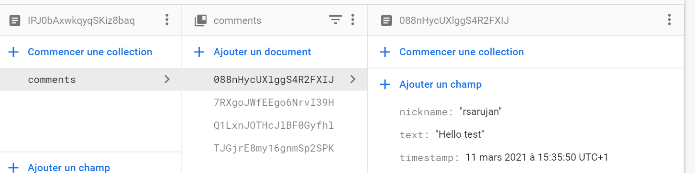

# README

## INTRODUCTION

Bienvenue dans le Projet React - Instagram. Ce projet consiste à créer un réseau social développé avec React une bibliothèque JavaScript permettant de créer des interfaces utilisateur, que nous avons appris dans le cadre de notre cursus à Ynov Paris Campus.

### INSTALLATION

Avant de commencer à utiliser leProjet React - Instagram, il vous faudra le télécharger sur votre machine en local. Pour cela, commencez par télécharger le code source du projet.

Avant d'aller plus loin, veuillez vous assurer que vous avez correctement installé [Node](https://nodejs.org/en/download/)

Version de node : `v14.15.1 ou supérieur`

Puis vérifiez que vous avez installé [npm](https://www.npmjs.com/get-npm)

Version de npm : `6.14.8 ou supérieur`

Une fois allé dans le projet, je vous invite à installer tous les packages nécessaires avec ces commandes:
```
 yarn upgrade; yarn add axios react-router-dom babel-eslint prettier-eslint eslint-config-prettier eslint-plugin-prettier eslint-plugin-react react-detect-offline styled-components firebase  --dev;
```

Enfin, il vous suffit de la lancer avec la commande
```
yarn start
```

Pour commencer à utiliser l'application, vous devrez ensuite ouvrir votre navigateur internet favori et accéder à l'URL suivant

> http://127.0.0.1:3000

#### Si problème
Si vous apercevez que les commentaires ainsi que les posts ne s'enregistrent pas, je vous invite à saisir cette commande
```
npm install -g firebase-tools; 
npm i firebase;
```

puis de relancer l'application avec cette commande
```
yarn start
```
### LES DIFFERENTES TABLES UTILISEES 
#### localStorage
Le localStorage va me permettre de stocker en local le token ainsi que l'username de la personne qui va se connecter.
De plus, le localStorage va enregistrer en local une table contenant la liste des favoris, c'est-à-dire lorsqu'on clique sur "like", on va l'ajouter en local car si l'utilisateur n'a plus de réseau, il pourra donc consulter ce qu'il a "liké" tout en mentionnant qu'il n'y a plus de réseau.

Image du localStorage:


#### firestore db
[Firestore] (https://firebase.google.com/docs/firestore) de Google Cloud est une base de données de documents NoSQL qui simplifie le développement d'applications. Bien que l'interface Firestore présente de nombreuses fonctionnalités identiques aux bases de données traditionnelles, elle diffère en tant que base de données NoSQL de ces bases de données par la manière dont elle décrit les relations entre les objets de données.

La base de données firestore va me permettre de stocker sur un cloud tous les posts ainsi que les commentaires afin de permettre à tous les utilisateurs d'accéder à tous les posts en plus de ceux qu'ils ont postés et/ou de les commenter. Si nous mettons ces données dans le localStorage, lorsqu'on quitte le navigateur ou lorsqu'on vide le cache, toute la base de données se supprimera alors qu'avec firestore, elle jouera le rôle de stockage mais aussi un rôle de jeu de test afin de tester l'application au cours du temps.

Image de table de post:

Un post est identifié avec un document (où ce dernier va jouer le rôle de l'id) et ce document à un nickname (l'username de la personne qui a posté), un avatar (photo de profil identique à tous les utilisateurs), l'imageUrl (le lien de l'image ou le fichier de l'image sous forme de lien), d'une caption (qui sera le commentaire laissé par le nickname) et enfin le timestamp (qui jouera le rôle d'afficher l'heure à laquelle le post a été publié afin de le trier).


Image de table de comments:

Comme pour la table post, un commentaire est identifié avec un document (où ce dernier va jouer le rôle de l'id) et ce document à un nickname (l'username de la personne qui va commenter), d'un text (qui sera le commentaire laissé par le username) et enfin le timestamp ((qui jouera le rôle d'afficher l'heure à laquelle le commentaire a été publié afin de le trier).




## UTILISATION

L'application se veut très simple d'utilisation, pour être accessible à la majorité des utilisateurs. Au lancement, vous arriverez sur la page de connexion, où on vous demandera de saisir votre username ainsi que le password et une fois que vous vous êtes connectés, vous verrez la page home où tous les posts de tous les utilisateurs seront affichés. Vous avez la possibilité de liker un post, d'y commenter et d'ajouter un post.

Pour voir la liste des favoris (qui sera tous les éléments que vous aurez liké tout au long de la connexion actuelle), il vous suffit de cliquer sur "Favorites" tout en haut.

Enfin, tout en haut à droite, vous aurez accès au bouton "Logout", permettant de se déconnecter de la session.